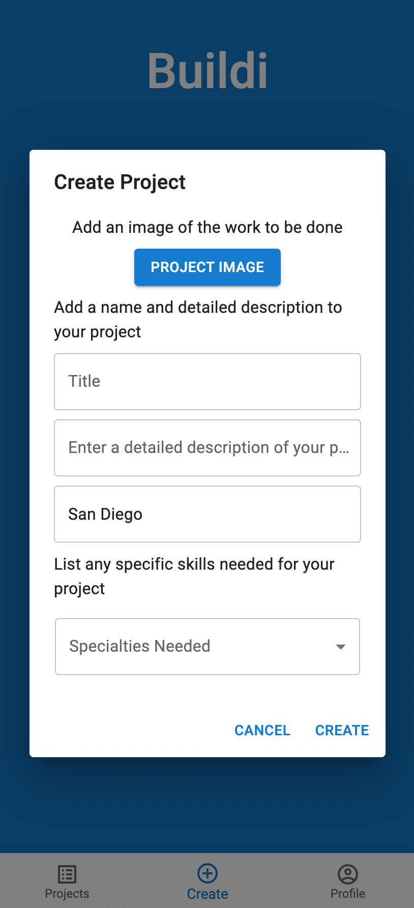

# Buildi

Buildi is a mobile PWA designed to connect independent contractors with homeowners seeking help with renovations.

## Screenshots

  

## Getting started

run npm i in server and client folders

## Build with

- [Next.js](https://nextjs.org/) - Backend React framework
  - [Typescript](https://www.typescriptlang.org/) - Strongly typed language for JavaScript
- [TailwindCSS](https://tailwindcss.com/) - CSS framework
- [MongoDB](https://www.mongodb.com/) - Database and Atlas for DB hosting
- [React](https://reactjs.org/) - Main front end framework
  - [Jest](https://jestjs.io/) - JavaScript testing framework
  - [Multer](https://testing-library.com/) - Testing utilities for React
  - [Mongoose](https://www.cypress.io/) - E2E testing for React
- [React](https://cloudinary.com/) - Image hosting and resizing

## Cool features

- ### Unique UI for User Type

  - Sign up as either a Buildi (client) or a Builder(contractor)
  - Buildi's can post projects, answer RFI's (request for information) and award projects to Builders
  - Builder's can bid on projects and ask RFI's

- ### PWA

  - Can be installed to homescreen on mobile

## Author

Matt D'Agostino - [Github](https://github.com/mattdags982) - [LinkedIn](https://www.linkedin.com/in/matthewgregorydagostino)
