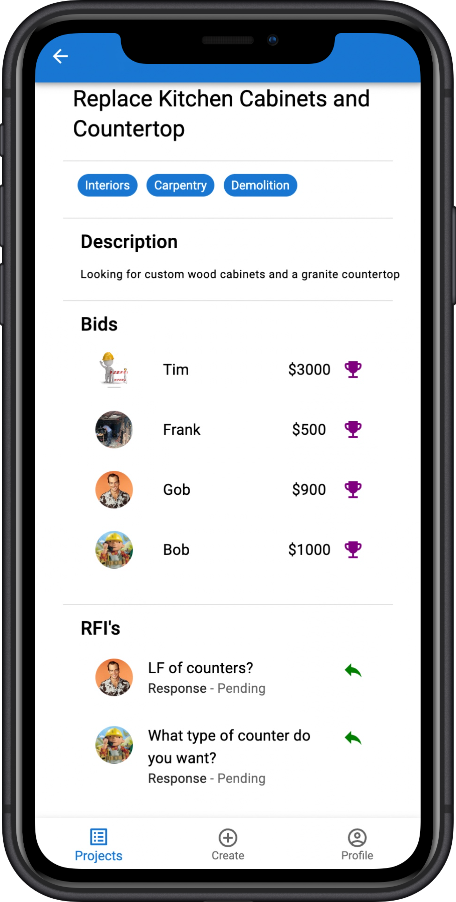
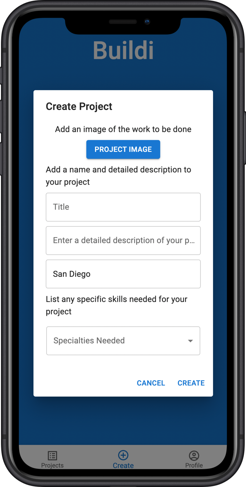
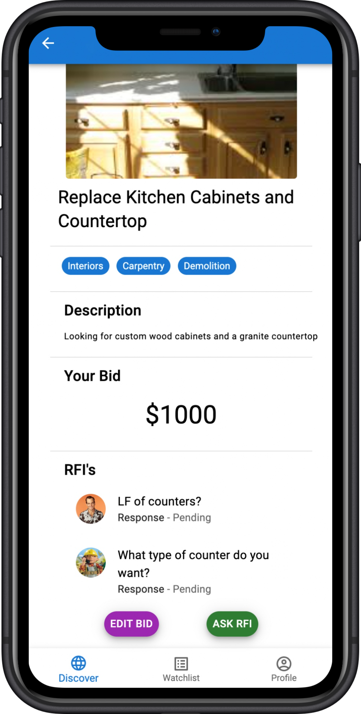

# Buildi

Buildi is a mobile PWA designed to connect independent contractors with homeowners seeking help with renovations.

## Screenshots

<p align="center" display="flex" gap="3px">
  
  
  

</p>

## Getting started

#### 1. Run npm install in both the server and client folders

```bash
npm install
```

#### 2. Turn on the server

```bash
node index.js
```

- make sure you are in the server folder
- should be on localhost:3000

#### 3. Run the React client from another terminal

```bash
npm start
```

- make sure you are in the client folder
- should be on localhost:3001

## Tech Stack

### Front End

- [React](https://reactjs.org/) - Main front end framework
- [Material UI](https://mui.com/) - UI component library

### Backend End

- [Express](https://expressjs.com/) - Backend framework for Node.js
- [MongoDB](https://www.mongodb.com/) - Database and Atlas for DB hosting
- [Mongoose](https://mongoosejs.com/) - Mongo ORM

## Features

- ### Unique UX for User Type

  - Sign up as either a Buildi (client) or a Builder(contractor)
  - Buildi's can post projects, answer RFI's (request for information) and award projects to Builders
  - Builder's can bid on projects and ask RFI's

- ### PWA

  - Can be installed to homescreen on mobile

## Author

Matt D'Agostino - [Github](https://github.com/mattdags982) - [LinkedIn](https://www.linkedin.com/in/matthewgregorydagostino)
